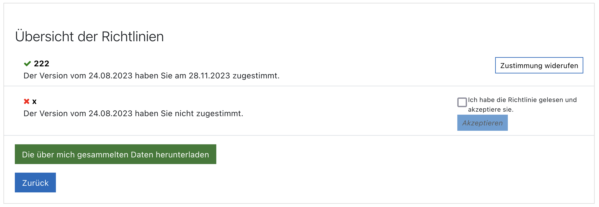

<br>
<div align="center">



</div>

<br>
<h1 align="center">Policy Overview</h1>

## *Policy Overview* is a Moodle local plugin that displays the policies a user has or has not agreed to. It also enables the user to download all data that has been stored about him/her in Moodle.


*Policy Overview** is a simple plugin that displays the policies a user has or has not agreed to before using the Moodle environment. Policies are typically user agreements, codes of conduct (netiquette), privacy policies or informed consents. By providing an overview of all policies that have been activated, the user is given the opportunity to access the policy text and re-decide whether to withdraw or agree to it. It also enables the user to download all data that has been stored about him/her in Moodle.

<!-- development-related badges -->
[](https://github.com/CATALPAresearch/local_policy_overview/commit-activity)
[](https://github.com/CATALPAresearch/local_policy_overview/commit/)
[](https://github.com/CATALPAresearch/local_policy_overview/contributors/)
[](https://github.com/CATALPAresearch/local_policy_overview/issues/)
[](http://perso.crans.org/besson/LICENSE.html)


<!-- Maturity-related badges 
see: https://github.com/mkenney/software-guides/blob/master/STABILITY-BADGES.md
-->
[](https://github.com/mkenney/software-guides/blob/master/STABILITY-BADGES.md#mature)


<!-- AI-related and LA-related badges -->
<!-- 
https://nutrition-facts.ai/
-->


<br><br>

<p align="center">
  <a href="#key-features">Key Features</a> •
  <a href="#how-to-use">How To Use</a> •
  <a href="#download">Download</a> •
  <a href="#credits">Credits</a> •
  <a href="#related">Related</a> •
  <a href="#citation">Citation</a> •
  <a href="#license">License</a>
</p>


## Key Features

**Students manage their policy agreements**
* Presents a list of policies that have been activated in Moodle
* Provides a link to each policy 
* Agreement to optional policies can be given or withdrawn at any time

**Students can download their personal data**
* A link is provided to download a ZIP file containing snapshots of all Moodle database tables that contain data about the user. 
* The snapshots are provided as CSV files and can be opened with comon spread sheet applications like LibreOffice Calc or Microsoft Excel.

**GDPR compliance**
The plugin fulfills requirements oblidged by the GDPR:
- Enabling OPT-IN to data processing within Moodle (or as part of a research project)
- Provision of information about collected data (typically availabe in the policy texts)
- Access the personal data that is stored and processed in Moodle


## Roadmap and Limitations
**Roadmap**
* Language localisation is poorly implemented so far.
* Grunt should be replaced by vue-only
* The overview provided about the policies doesn't prevent the poor presentation of the policies itself. A redesign of the policy presentation is therefore recommendable. 
* The possibility of opting out and in might lead to a fluctuating behavior that could be visualized to the user. On a timeline the periods of agreement and disagreement could be visualized for each policy. 
* Das exportable user data might be useless without any description and documentation. An automatized way of explaining the database tables would helpful.


## How To Use
```bash
# Clone this repository
$ git clone git@github.com:catalparesearch/local_policy_overview.git

# Rename the folder to 'policy_overview'
$ mv local_policy_overview policy_overview

# Go into the repository
$ cd policy_overview

# Install dependencies
$ npm install

# Build the plugin by transpiling the vue code into javascript
$ grunt plugin-build

# Open the page https://<moodle>/admin/index.php?cache=1 and follow the install instructions for the plugin or
$ php admin/cli/uninstall_plugins.php --plugins=local_policy_overview --run

# The install/update GUI should open automatically. Just follow the steps the GUI presents to you and you should have installed the *Policy Overview* plugin successfully afterwards. As an alternative to using the GUI for installation, you can also run the update script from within the folder of your Moodle installation:
$ php admin/cli/upgrade.php

# Open a Moodle course of you choice and add longpage as an activity to your course.
$ firefox open https://<path-to-your-moodle>/local/policy_overview/index.php
```

## Download

You can [download](https://github.com/catalparesearch/local_policy_overview/releases/tag/latest) the latest installable version of *Policy Overview* for Moodle 3.11.

## Getting into Development
```bash
# If you want to change the user interface, take a look at:
$ ./amd/src/Policy.js
# Don't forget to run Grunt to transpile the vue code into Javascript.
$ grunt plugin-build

# In case you want to improve the download of the user data you'll find the code in 
$ ./download_user_data.php

# To edit translations of terms you should take a look at the language files at 
$ ./lang/en/local_policy_overview.php
# and
$ ./lang/de/local_policy_overview.php

```


## Emailware

*Policy Overview* is an [emailware](https://en.wiktionary.org/wiki/emailware). Meaning, if you liked using this plugin or it has helped you in any way, I'd like you send me an email at <niels.seidel@fernuni-hagen.de> about anything you'd want to say about this software. I'd really appreciate it!

## Credits

This software uses the following open source package(s):
[vue.js](https://vuejs.org/). 

## Related

* [tool_policy](https://moodle.org/plugins/tool_policy) - Moodle core plugin. Provides teachers an overview about users that agreeed/disagreen to the policies.

## Citation

**Cite this software:**

tba.


## You may also like ...

* [format_serial3](https//github.com/catalparesearch/format_serial3) - Learning Analytics Dashboard for Moodle Courses
* [mod_usenet](https//github.com/catalparesearch/mod_usenet) - Usenet client for Moodle
* [local_ari](https//github.com/catalparesearch/local_ari) - Adaptation Rule Interface

## License

[GNU GPL v3 or later](http://www.gnu.org/copyleft/gpl.html)


## Contributors
* Niels Seidel [@nise81](https://twitter.com/nise81)
* Rene Heidbrink

---
<a href="https://www.fernuni-hagen.de/english/research/clusters/catalpa/"></a>
<a href="https://www.fernuni-hagen.de/"></a>


